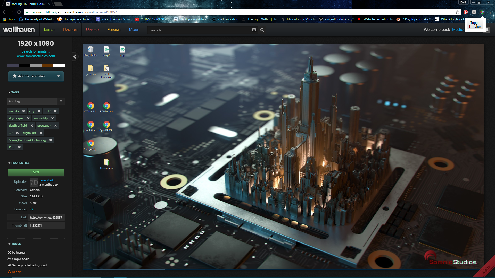

# Wallhaven-Extension
#### Enabling the extension
Not available on Chrome store yet - not fully polished, but you can load it unpacked by going to `chrome://extensions`, enabling developer mode, clicking on 'Load unpacked extension" and choosing this directory.
#### Use
Replace the "trans_desktop.png" with a transparent screenshot of your desktop. 
Here's what it looks like:

Note:
- Toggle button only hides the overlay, doesn't bring it back.
- I didn't make an icon for it. It's a default "hello world" icon.
- Overlay will stretch to match wallpaper dimensions, not a problem for most wallpapers.
